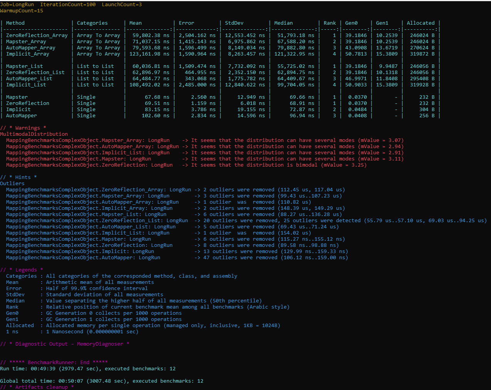
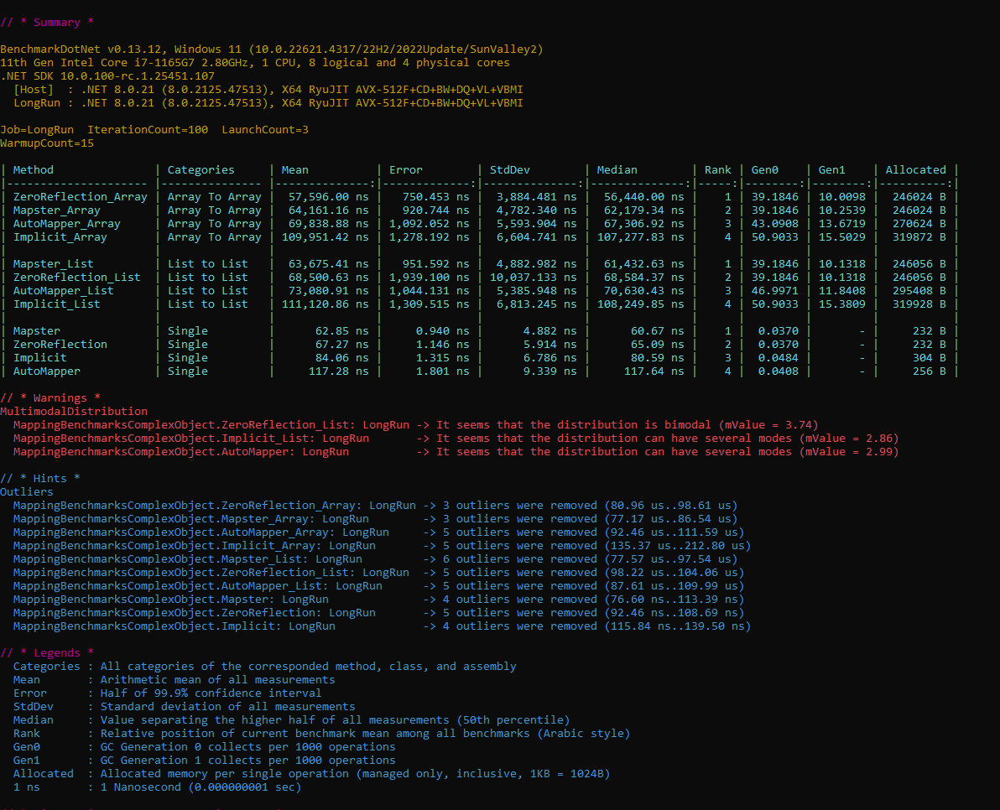
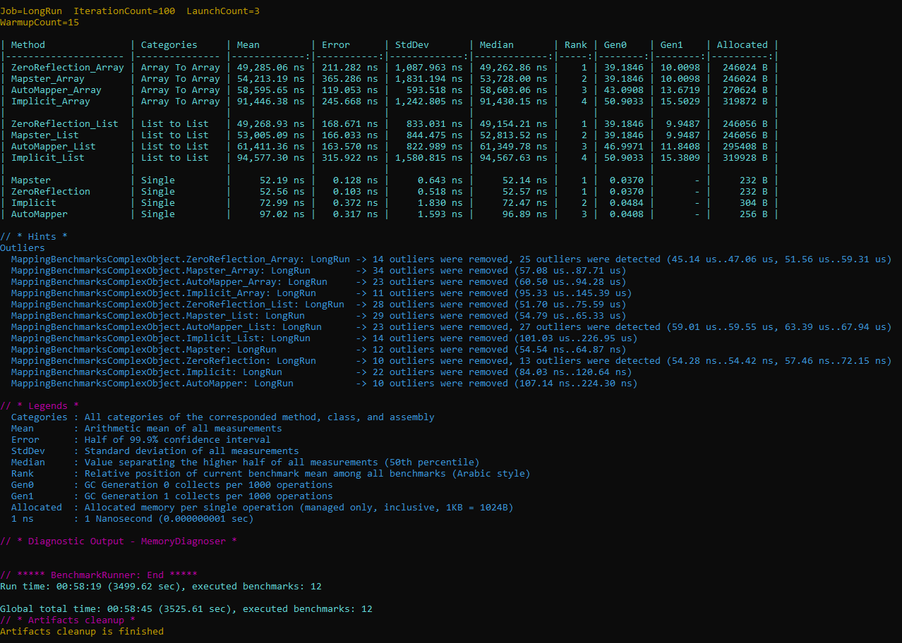
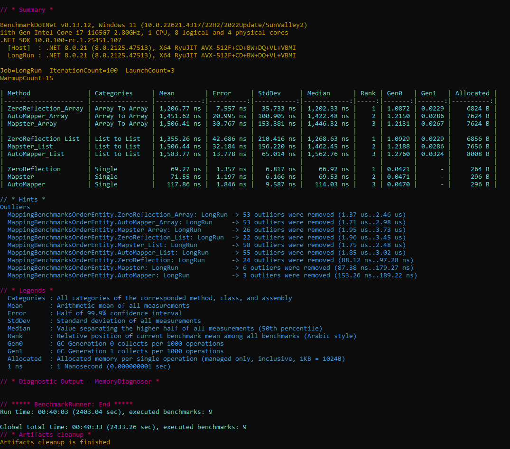
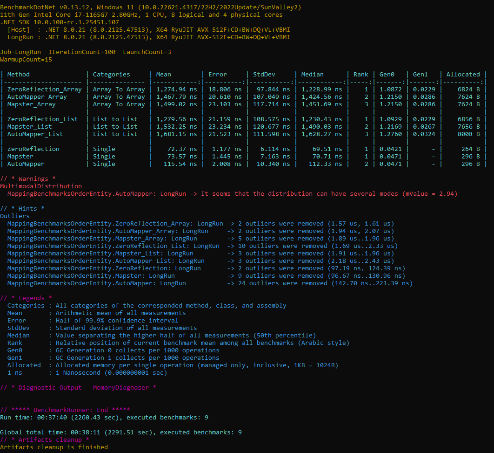

# ZeroReflection.Mapper

ZeroReflection.Mapper is a .NET source generator for object mapping. It enables fast, compile-time mapping between different object types, reducing boilerplate and improving performance.

## Features
- Attribute-based mapping configuration
- Custom mapping profiles
- Ignore properties with attributes
- Optional LINQ projection expressions (compile-time generated)
- Fast dispatcher for arrays/lists/single objects (if/else or switch jump-table)
- Source generator for high performance

## Getting Started
Add the NuGet package to your project:

```
dotnet add package ZeroReflection.Mapper
```

Annotate your classes with mapping attributes and implement mapping profiles as needed. See the [documentation](https://ZeroReflection.example.com) for details.


## Defining a Mapper Profile
A Mapper Profile in ZeroReflection.Mapper allows you to configure how objects are mapped between types. To define a profile:

1. Inherit from `MapperProfile`.
2. Override the `Configure` method and use the provided `MapperConfiguration` to set up your mappings.

> **Note:** If you are not interested in projections, use `config.EnableProjectionFunctions = false;` in your profile configuration. This will prevent the generator from emitting LINQ projection expressions and compiled delegates.
> Notes
> - If you are not interested in projections, use `config.EnableProjectionFunctions = false;`. When `false`, projection members may still be selectively generated for collection element types used by other mappings.
> - `config.UseSwitchDispatcher` controls whether the dispatcher uses a switch-based jump table or chained type checks.
> - `config.ThrowIfPropertyMissing` injects build-time `#error` for unmapped destination properties.

### Example
```csharp
using ZeroReflection.Mapper;

public class ZeroReflectionMapperProfile : MapperProfile
{
    public override void Configure(MapperConfiguration config)
    {
        // Enable projection functions (for LINQ and compiled delegates)
        // Projection functions (Projection, ListProjection, ArrayProjection + compiled delegates)
        config.EnableProjectionFunctions = true;
        // If you do NOT want projections, set to false:
        // config.EnableProjectionFunctions = false;
        // Dispatcher strategy
        config.UseSwitchDispatcher = true;
        // Build will fail if a destination property cannot be mapped (unless ignored or custom mapped)
        config.ThrowIfPropertyMissing = false;

        // Simple mapping with reverse
        config.CreateMap<PersonModel, PersonEntity>().Reverse();

        // Custom member mapping and ignore
        config.CreateMap<ProductModel, ProductEntity>()
            .ForMember(dest => dest.Id, source => Guid.NewGuid().ToString() + "#125")
            .Ignore(dest => dest.Manufacturer);

        // Reverse mapping for customized ones
        // Reverse mapping for customized ones must be defined explicitly
        config.CreateMap<ProductEntity, ProductModel>();

        // Custom mapping function
        config.CreateMap<BalanceEntity, BalanceModel>()
            .WithCustomMapping(StaticMappers.MapBalanceModelToBalanceEntity);

        // Reverse mapping for custom mapping
        config.CreateMap<BalanceModel, BalanceEntity>();
    }
}

public class StaticMappers
{
    public static BalanceModel MapBalanceModelToBalanceEntity(BalanceEntity entity)
    {
        return new BalanceModel
        {
            Id = entity.Id,
            UserId = entity.UserId,
            Amount = entity.Amount,
            CreatedAt = entity.CreatedAt,
            UpdatedAt = entity.UpdatedAt,
            IsDeleted = entity.IsDeleted
        };
    }
}
```

### Key Features
- **Reverse Mapping**: Use `.Reverse()` to generate mappings in both directions.
- **Custom Member Mapping**: Use `.ForMember()` to customize how individual properties are mapped.
- **Ignore Properties**: Use `.Ignore()` to skip mapping specific properties.
- **Custom Mapping Functions**: Use `.WithCustomMapping()` to provide your own mapping logic.
### Key Points
- Reverse Mapping: `.Reverse()` adds the reverse direction only for simple mappings. It is not allowed after `WithCustomMapping`, `ForMember`, or `Ignore`. Define a separate reverse mapping instead.
- Custom Member Mapping: Use `.ForMember()` to customize individual properties.
- Ignore Properties: Use `.Ignore()` to skip specific destination properties.
- Custom Mapping Functions: Use `.WithCustomMapping()` to provide your own mapping logic.

For more details, see the sample profile in `Application/ZeroReflectionMapperProfile.cs`.

## Dependency Injection Registration
To use ZeroReflection.Mapper with .NET Dependency Injection, register the mapping handlers and obtain an `IMapper` instance as follows:
To use ZeroReflection.Mapper with .NET Dependency Injection, register the mapping services and obtain an `IMapper` instance as follows:

```csharp
using Microsoft.Extensions.DependencyInjection;
using ZeroReflection.Mapper;

var services = new ServiceCollection();
services.RegisterZeroReflectionMapping();

var sp = services.BuildServiceProvider();
var myMapper = sp.GetRequiredService<IMapper>();
```

- `RegisterZeroReflectionMapping()` scans and registers all mapping profiles and handlers.
- `RegisterZeroReflectionMapping()` registers `IMapper` and the generated `IGeneratedMappingDispatcher`.
- You can now inject or resolve `IMapper` anywhere in your application.

Note: the optional `configure` delegate parameter on `RegisterZeroReflectionMapping` is currently not used by the generator output.

This approach works seamlessly with ASP.NET Core or any .NET application using Microsoft.Extensions.DependencyInjection.

## Using the mapper at runtime
You can use either the generated static extension methods or the `IMapper` service:

- Generated methods per map, for single objects:
    - `var entity = model.MapToPersonEntity();`
- Collections/arrays (generated helpers):
    - `var list = MapPersonModelToPersonEntity.MapListToPersonEntity(models);`
    - `var arr = MapPersonModelToPersonEntity.MapArrayToPersonEntity(modelsArray);`
- Via `IMapper` (collections/arrays):
    - `var list = myMapper.Map<System.Collections.Generic.List<PersonEntity>>(models);`
    - `var arr = myMapper.Map<PersonModel[], PersonEntity[]>(modelsArray);`
- Via `IMapper` (single object):
    - `var entity = myMapper.MapSingleObject<PersonModel, PersonEntity>(model);`

## What is being generated

ZeroReflection.Mapper Source Generator produces several types of files to support mapping and DI registration:

### 1. DI Registration Extension
This code provides DI registration for all mapping components, including the core mapper, dispatcher, and individual mapping handlers:
Registers the core mapper and the generated dispatcher.

```csharp
// <auto-generated />
using Microsoft.Extensions.DependencyInjection;
using ZeroReflection.Mapper;
using Application.Models.ViewModels;
using Application.Models.Entities;

namespace ZeroReflection.Mapper.Generated
{
    // Provides a single extension point to register all source-generated mapping components into DI.
    // Adds: IMapper (core implementation), IGeneratedMappingDispatcher (fast jump-table dispatcher),
    // and each concrete IMap<TSource,TDestination> handler for direct resolution / testing / fallback.
    // Safe to call once at application startup (idempotent with typical DI containers registering singletons).
    // Generated at 2025-08-20T14:30:12.4508116+02:00
    // Provides a single extension point to register generated mapping components into DI.
    // Adds: IMapper (core implementation) and IGeneratedMappingDispatcher (fast dispatcher).
    public static class MappingServiceExtensions
    {
        /// <summary>Registers all generated mapping services (mapper, dispatcher, individual handlers).</summary>
        public static IServiceCollection RegisterZeroReflectionMapping(this IServiceCollection services, System.Action<MapperConfiguration> configure = null)
        {
            services.AddSingleton<IMapper, Mapper>();
            services.AddSingleton<IGeneratedMappingDispatcher, GeneratedMappingDispatcher>();

            return services;
        }
    }
}
```

This generated code ensures all mapping services are registered in your DI container, making it easy to resolve and use mapping functionality throughout your application.

### 2. Mapping Logic Example
This code shows a typical generated mapping class for converting between models and entities, including support for collections, nested objects, and LINQ projection expressions:
Typical generated mapping class for converting between models and entities, including support for collections, nested objects, and optional LINQ projection expressions:

```csharp
// <auto-generated />
using System;
using System.Linq;
using ZeroReflection.Mapper;
using Application.Models.ViewModels;
using Application.Models.Entities;

namespace ZeroReflection.Mapper.Generated
{
    // Generated at 2025-08-20T14:30:12.4508531+02:00
    public static class MapPersonModelToPersonEntity
    {
        public static global::Application.Models.Entities.PersonEntity MapToPersonEntity(this global::Application.Models.ViewModels.PersonModel source)
        {
            if (source == null) return null;

            return new global::Application.Models.Entities.PersonEntity
            {
                Email = source.Email,
                Age = source.Age,
                Name = source.Name,
                Certificate = source.Certificate == null ? null : MapCertificateModelToCertificateEntity.MapToCertificateEntity(source.Certificate),
                Addresses = MapAddressModelToAddressEntity.MapListToAddressEntity(source.Addresses)
            };
        }

        public static System.Collections.Generic.List<global::Application.Models.Entities.PersonEntity> MapListToPersonEntity(System.Collections.Generic.List<global::Application.Models.ViewModels.PersonModel> source) => ZeroReflection.Mapper.CodeGeneration.MapCollectionHelpers.MapList<global::Application.Models.ViewModels.PersonModel,global::Application.Models.Entities.PersonEntity>(source, x => x.MapToPersonEntity());
        [System.Runtime.CompilerServices.MethodImpl(System.Runtime.CompilerServices.MethodImplOptions.AggressiveInlining)]

        public static global::Application.Models.Entities.PersonEntity[] MapArrayToPersonEntity(global::Application.Models.ViewViews.PersonModel[] source)
        {
            if (source == null) return null;
            var result = new global::Application.Models.Entities.PersonEntity[source.Length];
            for (int i = 0; i < source.Length; i++)
                result[i] = source[i].MapToPersonEntity();
            return result;
        }
            => ZeroReflection.Mapper.CodeGeneration.MapCollectionHelpers.MapArray<global::Application.Models.ViewModels.PersonModel,global::Application.Models.Entities.PersonEntity>(source, x => x.MapToPersonEntity());

        [System.Runtime.CompilerServices.MethodImpl(System.Runtime.CompilerServices.MethodImplOptions.AggressiveInlining)]
        public static global::Application.Models.Entities.PersonEntity[] MapListToPersonEntityArray(System.Collections.Generic.List<global::Application.Models.ViewModels.PersonModel> source)
        {
            if (source == null) return null;
            var result = new global::Application.Models.Entities.PersonEntity[source.Count];
            for (int i = 0; i < source.Count; i++)
                result[i] = source[i].MapToPersonEntity();
            return result;
        }

        public static System.Collections.Generic.List<global::Application.Models.Entities.PersonEntity> MapArrayToPersonEntityList(global::Application.Models.ViewModels.PersonModel[] source) => ZeroReflection.Mapper.CodeGeneration.MapCollectionHelpers.MapArrayToList<global::Application.Models.ViewModels.PersonModel,global::Application.Models.Entities.PersonEntity>(source, x => x.MapToPersonEntity());

        /// <summary>Expression for single item projection using Map method.</summary>
        // Projection members are generated when enabled in configuration (globally, or selectively for collection element types)
        public static System.Linq.Expressions.Expression<System.Func<global::Application.Models.ViewModels.PersonModel, global::Application.Models.Entities.PersonEntity>> Projection => source => source.MapToPersonEntity();

        /// <summary>Expression for List<TSource> projection using list mapping method.</summary>
        public static System.Linq.Expressions.Expression<System.Func<System.Collections.Generic.List<global::Application.Models.ViewModels.PersonModel>, System.Collections.Generic.List<global::Application.Models.Entities.PersonEntity>>> ListProjection => list => MapListToPersonEntity(list);

        /// <summary>Expression for array projection using array mapping method.</summary>
        public static System.Linq.Expressions.Expression<System.Func<global::Application.Models.ViewModels.PersonModel[], global::Application.Models.Entities.PersonEntity[]>> ArrayProjection => array => MapArrayToPersonEntity(array);
    }
}
```

This generated mapping class provides efficient conversion between types, including support for arrays, lists, nested objects, and LINQ projections for advanced scenarios.

### 3. Generated Mapping Dispatcher Example
A dispatcher is also generated to provide ultra-fast, reflection-free mapping between types. It uses type checks to route conversions for single objects, arrays, and lists. This enables efficient runtime mapping without reflection:
A dispatcher provides reflection-free mapping between types. It routes conversions for single objects, arrays, and lists.

- If `UseSwitchDispatcher = false` (default behavior in code example below), chained type checks are emitted.
- If `UseSwitchDispatcher = true`, an index and switch-based jump table is emitted for faster dispatch.

```csharp
// <auto-generated />
using System;
using System.Runtime.CompilerServices;
using ZeroReflection.Mapper;
using Application.Models.ViewModels;
using Application.Models.Entities;

namespace ZeroReflection.Mapper.Generated
{
    // This static helper provides ultra-fast dispatch for generated mappings without reflection.
    // It uses a sequence of exact type checks (jump table style) to route source->destination conversions.
    // Generic TryMap<TSource,TDestination> covers strongly-typed calls; TryMapObj handles runtime (object) scenarios.
    // Collection variants (List<> / array combinations) are inlined so we avoid per-element reflection overhead.
    // Generated at 2025-08-20T14:38:48.6885480+02:00
    internal static class __GeneratedMappingDispatcherStatic
    {
        [MethodImpl(MethodImplOptions.AggressiveInlining)]
        internal static bool TryMapArray(object source, Type sourceType, Type destType, out object result)
        {
            if (source is null) { result = null!; return true; }
            if (sourceType == typeof(PersonModel[]) && destType == typeof(PersonEntity[])) { result = MapPersonModelToPersonEntity.MapArrayToPersonEntity((PersonModel[])source)!; return true; }
            // ...other type checks...
            result = null!; return false;
        }

        [MethodImpl(MethodImplOptions.AggressiveInlining)]
        internal static bool TryMapList(object source, Type sourceType, Type destType, out object result)
        {
            if (source is null) { result = null!; return true; }
            if (sourceType == typeof(System.Collections.Generic.List<PersonModel>) && destType == typeof(System.Collections.Generic.List<PersonEntity>)) { result = MapPersonModelToPersonEntity.MapListToPersonEntity((System.Collections.Generic.List<PersonModel>)source)!; return true; }
            // ...other type checks...
            result = null!; return false;
        }

        [MethodImpl(MethodImplOptions.AggressiveInlining)]
        internal static bool TryMapSingleObject(object source, Type sourceType, Type destType, out object result)
        {
            if (source is null) { result = null!; return true; }
            if (sourceType == typeof(PersonModel) && destType == typeof(PersonEntity)) { result = ((PersonModel)source).MapToPersonEntity(); return true; }
            // ...other type checks...
            result = null!; return false;
        }
    }

    public sealed class GeneratedMappingDispatcher : IGeneratedMappingDispatcher
    {
        public bool TryMapArray(object source, Type sourceType, Type destType, out object result)
            => __GeneratedMappingDispatcherStatic.TryMapArray(source, sourceType, destType, out result);

        public bool TryMapList(object source, Type sourceType, Type destType, out object result)
            => __GeneratedMappingDispatcherStatic.TryMapList(source, sourceType, destType, out result);

        public bool TryMapSingleObject(object source, Type sourceType, Type destType, out object result)
            => __GeneratedMappingDispatcherStatic.TryMapSingleObject(source, sourceType, destType, out result);
    }
}
```

#### Switch jump-table variant (when `UseSwitchDispatcher = true`)
Below is an abbreviated example of the switch-based dispatcher the generator emits. Dictionaries assign small integer keys for each mapping pair; a `switch` routes the request.

```csharp
// <auto-generated />
namespace ZeroReflection.Mapper.Generated
{
    internal static class __GeneratedMappingDispatcherStatic
    {
        private static readonly System.Collections.Generic.Dictionary<(System.Type, System.Type), int> _arrayMapIndex = new()
        {
            { (typeof(PersonModel[]), typeof(PersonEntity[])), 1 },
            { (typeof(ProductModel[]), typeof(ProductEntity[])), 2 },
            // ... more pairs ...
        };
        private static readonly System.Collections.Generic.Dictionary<(System.Type, System.Type), int> _listMapIndex = new()
        {
            { (typeof(System.Collections.Generic.List<PersonModel>), typeof(System.Collections.Generic.List<PersonEntity>)), 1 },
            { (typeof(System.Collections.Generic.List<ProductModel>), typeof(System.Collections.Generic.List<ProductEntity>)), 2 },
            // ... more pairs ...
        };
        private static readonly System.Collections.Generic.Dictionary<(System.Type, System.Type), int> _objectMapIndex = new()
        {
            { (typeof(PersonModel), typeof(PersonEntity)), 1 },
            { (typeof(ProductModel), typeof(ProductEntity)), 2 },
            // ... only pairs with direct object maps ...
        };

        internal static bool TryMapArray(object source, System.Type sourceType, System.Type destType, out object result)
        {
            if (source is null) { result = null!; return true; }
            if (!_arrayMapIndex.TryGetValue((sourceType, destType), out int key)) { result = null!; return false; }
            switch (key)
            {
                case 1: result = MapPersonModelToPersonEntity.MapArrayToPersonEntity((PersonModel[])source)!; return true;
                case 2: result = MapProductModelToProductEntity.MapArrayToProductEntity((ProductModel[])source)!; return true;
                // ... more cases ...
                default: result = null!; return false;
            }
        }

        internal static bool TryMapList(object source, System.Type sourceType, System.Type destType, out object result)
        {
            if (source is null) { result = null!; return true; }
            if (!_listMapIndex.TryGetValue((sourceType, destType), out int key)) { result = null!; return false; }
            switch (key)
            {
                case 1: result = MapPersonModelToPersonEntity.MapListToPersonEntity((System.Collections.Generic.List<PersonModel>)source)!; return true;
                case 2: result = MapProductModelToProductEntity.MapListToProductEntity((System.Collections.Generic.List<ProductModel>)source)!; return true;
                // ... more cases ...
                default: result = null!; return false;
            }
        }

        internal static bool TryMapSingleObject(object source, System.Type sourceType, System.Type destType, out object result)
        {
            if (source is null) { result = null!; return true; }
            if (!_objectMapIndex.TryGetValue((sourceType, destType), out int key)) { result = null!; return false; }
            switch (key)
            {
                case 1: result = ((PersonModel)source).MapToPersonEntity(); return true;
                case 2: result = ((ProductModel)source).MapToProductEntity(); return true;
                // ... more cases ...
                default: result = null!; return false;
            }
        }
    }
}
```

This variant avoids repeated `if` type comparisons and can reduce dispatch overhead when many mappings exist.

## Configuration flags
Set these in your `MapperProfile.Configure` method via the provided `MapperConfiguration` instance:

- `EnableProjectionFunctions` (default `false`)
    - When `true`, projection expressions and compiled delegates are emitted for every mapping.
    - When `false`, the generator may still emit projection members selectively for mappings that appear as collection element types in other mappings.
- `UseSwitchDispatcher` (default `true`)
    - Emits a switch-based jump table for the dispatcher when `true`; chained type checks when `false`.
- `ThrowIfPropertyMissing` (default `false`)
    - Emits build-time `#error` diagnostics for unmapped destination properties unless explicitly ignored or custom-mapped.

## Attributes
- `IgnoreMapAttribute` on a destination or source property to exclude it from mapping.
- `MapToAttribute("OtherName")` on a property to map by a different name.
- `CustomMappingAttribute(typeof(Source), typeof(Destination))` on a method to use that method for the specified map.
- `CustomPropertyMappingAttribute(typeof(Source), typeof(Destination), "PropertyName")` on a method to provide custom logic for a single destination property.

## Benchmarks

Performance is a key focus of ZeroReflection.Mapper. Benchmarks are provided to demonstrate mapping speed, memory usage, and comparison to other mapping libraries.

Benchmark code and scenarios can be found in the `ZeroReflection.Benchmarks/` project.

The “WithSwitch” benchmark variants correspond to enabling `UseSwitchDispatcher`.

### Example Benchmark: Mapping a Complex Person Object

The following sample is used to benchmark mapping a complex `PersonEntity` object:

```csharp
PersonEntity PersonSample = new()
{
    Email = $"person@mail.com",
    Age = 10,
    Name = $"Person Name ",
    Certificate = new CertificateEntity()
    {
        CertificateId = $"CertId ",
        CertificateName = $"Certificate Name ",
        ExpiryDate = DateTime.Now
    },
    Addresses =
    [
        new()
        {
            Street = $"Street ",
            City = $"City ",
            ZipCode = $"ZipCode ",
        }
    ]
};
```

*Example: Mapping speed comparison for a single complex object using ZeroReflection.Mapper, Mapster, and AutoMapper.*

#### Long Running Job:







---

### Example Benchmark: Mapping Order Object

The following sample is used to benchmark mapping `OrderEntity` object:

```csharp
OrderEntity _OrderEntity = new()
{
    Id = 1,
    OrderNumber = "OrderNumber",
    OrderDate = DateTime.Now,
    TotalAmount = 10,
    CustomerName = "CustomerName",
    CustomerEmail = "CustomerEmail",
    ShippingAddress = "ShippingAddress",
    BillingAddress = "BillingAddress",
    OrderStatus = $"Pending ",
    ShippedDate = DateTime.Now,
    DeliveredDate = DateTime.Now,
    TrackingNumber =  $"Pending 11",
    PaymentMethod = $"Pending 9",
    Notes = $"Pending 10",
    CustomerPhone = $"Pending 1",
    CustomerAddress = $"Pending 2",
    CustomerCity = $"Pending 3",
    CustomerState = $"Pending 4",
    CustomerZipCode = $"Pending 5",
    CustomerCountry = $"Pending 6",
    CustomerCompany = $"Pending 7",
    CustomerTaxId = $"Pending 8",
};
```

#### Long Running Job:




